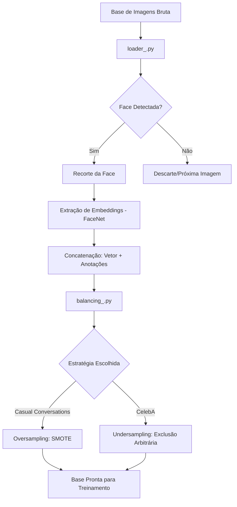

# Vetorização e Balanceamento de Dados

Este diretório contém o pipeline de pré-processamento das bases de dados utilizadas para o treinamento das instâncias do classificador. 

O fluxo de preparação de cada base de imagens consiste primordialmente em duas etapas:
1. **Vetorização com FaceNet**
2. **Balanceamento de Classes** (via *Oversampling* com SMOTE ou *Undersampling* genérico por exclusão de excedentes)

---

## Bases de Dados Utilizadas

Foram utilizadas duas bases de dados distintas, configuradas conforme a tabela abaixo:

| Base de Dados | Descrição | Quantidade de Imagens |
| :--- | :--- | :--- |
| [CelebA Dataset](https://mmlab.ie.cuhk.edu.hk/projects/CelebA.html) | Composto por mais de 200.000 imagens anotadas automaticamente com 40 atributos binários (ex: `young`, `have_mustache`, `male`). | 202.000 imagens selecionadas do total disponível. |
| [Casual Conversations v2](https://ai.meta.com/datasets/casual-conversations-v2-dataset/) | Composto por mais de 26.000 vídeos divididos em frames, contendo atributos autoanotados (ex: `fitzpatrick_skintone`, `monk_scale`, `hair_type`, `hair_color`, `eye_color`). | 230.000 frames extraídos do total disponível. |

---

## 1. Vetorização via FaceNet

Nesta etapa, o script Python `loader_{dataset_name}.py` percorre os diretórios das imagens e gera os *embeddings* processados em lotes (*batches*). 

Para cada lote, a extração de características segue rigorosamente a seguinte ordem de execução:
* **Detecção Facial:** Identificação e isolamento da face na imagem (quando detectada).
* **Recorte (*Cropping*):** Redimensionamento e recorte da região exata da face identificada.
* **Vetorização e Concatenação:** Geração dos vetores de características face a face, concatenando-os diretamente com suas respectivas anotações binárias/categóricas.

---

## 2. Balanceamento das Bases de Imagens

Após a vetorização completa, o balanceamento é realizado com base na distribuição de classes do atributo mais relevante de cada base. O script `balancing_{dataset_name}.py` executa esse processo seguindo os critérios abaixo:

1. **Seleção do Pivô:** Escolha do atributo principal que servirá de referência para o balanceamento da base.
2. **Definição da Estratégia:**
   * **Oversampling:** Aplicado ao atributo `fitz_type` na base *Casual Conversations v2*.
   * **Undersampling:** Aplicado ao atributo `Male` na base *CelebA Dataset*.
3. **Aplicação do Método:**
   * Para o cenário de *oversampling*, utilizou-se o algoritmo **SMOTE**.
   * Para o cenário de *undersampling*, aplicou-se a **exclusão aleatória dos dados excedentes** da classe majoritária.

---

### Fluxo Visual de Execução

